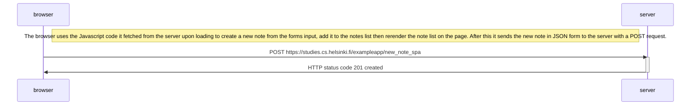

```mermaid
    sequenceDiagram
        participant browser
        participant server

        Note right of browser: The browser uses the Javascript code it fetched from the server upon loading to create a new note from the forms input, add it to the notes list then rerender the note list on the page. After this it sends the new note in JSON form to the server with a POST request.

        browser->>server: POST https://studies.cs.helsinki.fi/exampleapp/new_note_spa
        activate server
        server->>browser: HTTP status code 201 created
        deactivate server
```